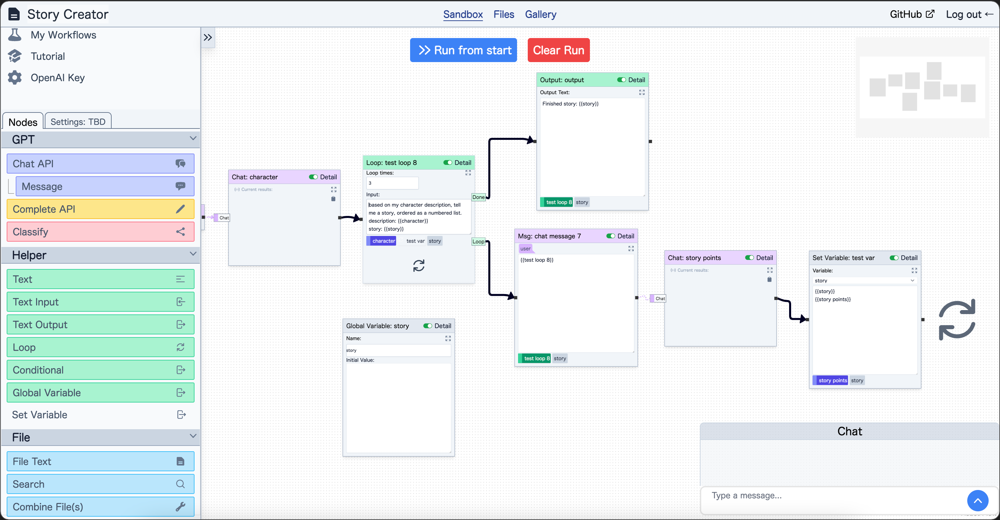

# promptsandbox.io

promptsandbox.io is a free, open-source, node-based visual programming tool designed to help users create powerful workflows with OpenAI APIs. With an intuitive drag-and-drop interface, users can build dynamic chains of nodes, each performing a specific operation as part of the workflow. This project is built using React, focusing primarily on OpenAI APIs and providing a seamless experience for users working with these APIs.


## Demo

1. Check out the demo here: [https://promptsandbox.io/](https://promptsandbox.io/)
2. Enter your OpenAI API key by clicking the button at the bottom left corner.

## Features

- Node-based visual programming interface for creating workflows.
- Integration with OpenAI APIs, including the Chat and Completion APIs.
- File upload and retrieval.
- Support for various node types, such as Text Input, Text Output, Chat Message, Chat API, and more.
- Debugging tools, such as breakpoints and running specific nodes, for inspecting the data passed between nodes.
- Example workflows for various use cases, with screenshots and links to actual workflows.
- Extensibility with additional node types for more complex workflows.

## Getting Started

### Prerequisites

- Node.js
- NPM/Yarn

### Installation

1. Clone the repository:

```bash
git clone https://github.com/your-username/promptsandbox.io.git
```

2. Change to the project directory:

```bash
cd promptsandbox.io
```

3. Install dependencies using Yarn:

```bash
yarn install
```

4. Run the development server:

```bash
yarn dev
```

5. Open your browser and navigate to `http://localhost:5173` to access promptsandbox.io.

## Usage

1. Select and drag nodes from the left panel onto the canvas to start building your workflow.
2. Connect nodes by dragging a line from the output of one node to the input of another.
3. Configure node settings and input values as needed.
4. Provide an OpenAI API key by clicking the button at the bottom left corner and entering your key.
5. Execute the workflow to see the results generated by interacting with the OpenAI APIs.

## Roadmap

Future enhancements include:

- Integration with other AI models and APIs.
- Additional node types for more complex workflows.
- Improved UI and UX for managing and visualizing the conversation flow.
- Gallery of example workflows for various use cases.

## Contributing

We welcome contributions to promptsandbox.io! Please follow these steps to contribute:

1. Fork the repository.
2. Create a new branch with a descriptive name for your feature or bugfix.
3. Commit your changes to the new branch.
4. Create a pull request and provide a clear description of your changes.
